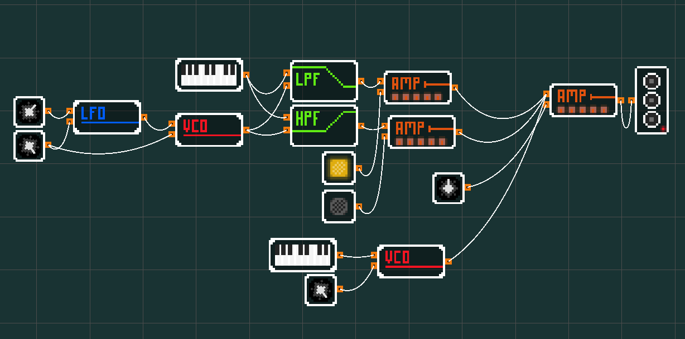

# Modular Synthesizer
### Overview
Used to simulate a modular synthesizer which can take inputs from knobs, a keyboard based piano, and buttons, filter the signal with various voltage controlled elements, and then output the synthesized signal to the speakers.



I've been building this on my Mac and haven't tested it on any other platforms, so that might take some tweaking.

### Controls
To run:
```
bazel run //:main
```

Pressing `Tab` will print a message in the terminal like:
```
Press '1' to spawn 'Amplifier'
Press '2' to spawn 'Button'
Press '3' to spawn 'High Pass Filter'
Press '4' to spawn 'Knob'
Press '5' to spawn 'Low Frequency Oscillator'
Press '6' to spawn 'Low Pass Filter'
Press '7' to spawn 'Piano'
Press '8' to spawn 'Speaker'
Press '9' to spawn 'Voltage Controlled Oscillator'
```
Pressing the specified key will add a block of that type. Each block has input and output ports which can be connected by CLI clicking and holding on one of the outputs of one block, then while holding down the mouse button you can drag the cable to the input of another block. When the mouse is released a connection is formed.

To remove blocks or connections, control click on the block. Undoing should work with `control-z`. Saving can be done with `control-s`, which will save the current state to a /tmp file. `control-l` will load the saved file.

